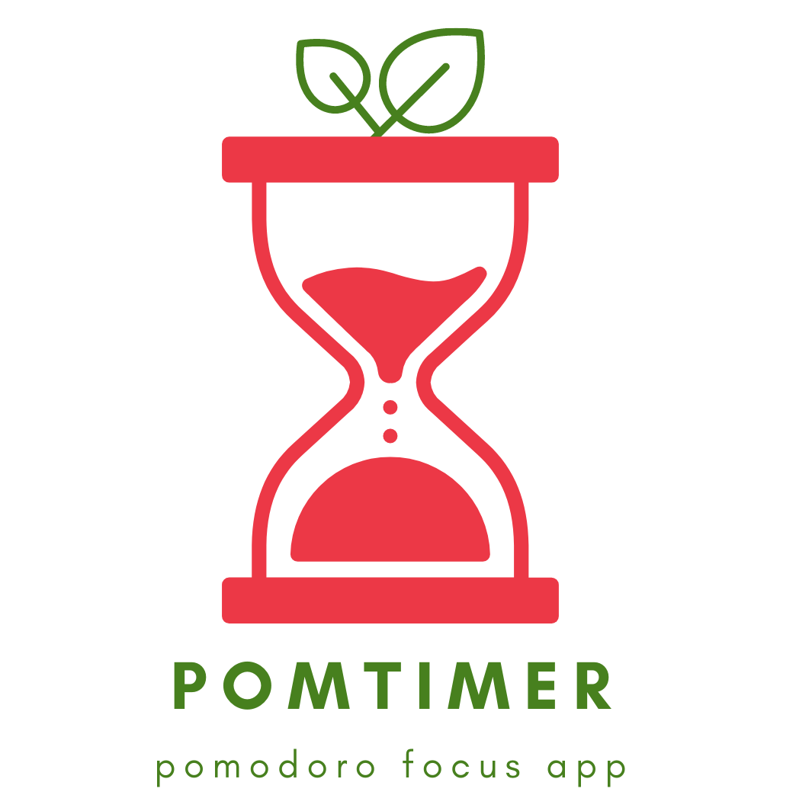

# PomTimer

## Motavation
This is a personal projct to help me learn JavaScript, HTML, and CSS and apply parts of these launguages that I already know. There is a project similar to this one called pomofocus.io that I have used to help me with productivity and focus. However, there are some features of this webapp that are behind a paywall. I didn't like this! Since I am an aspiring software devloper I decided to use my knowledge to develop my own version of this app and improve upon its design. I am hoping to integrate all major features found on pomfocus.io and add some new ones!

## Visuals
[Placeholder]

## Installation
Currently ran using a vite environment and hosted on LocalHost:3000

## Usage

## Development Tools and Libraries Used

## Resources

## Support

## Roadmap

## Contributing

## Authors and acknowledgment

## License
Currently this is a private project. I Noah Jackson am the only person allowed to make changes.

Copyright © 2022, Noah Jackson, All rights reserved.

## Project status

